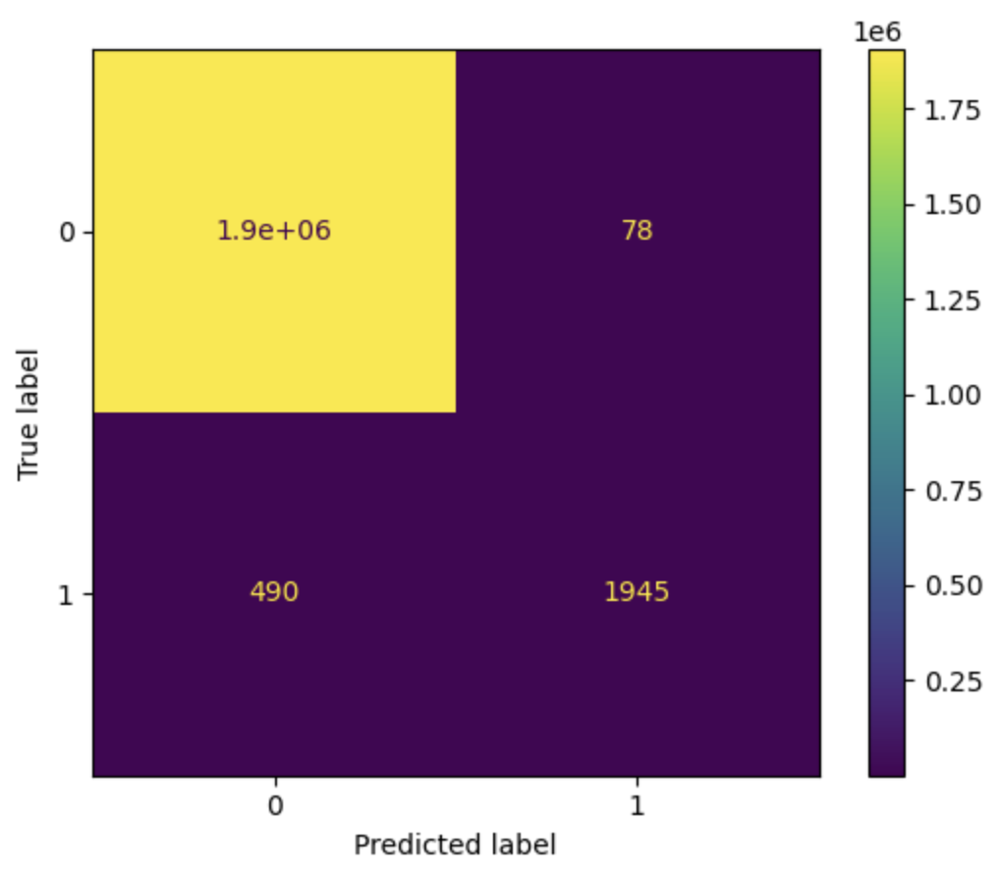
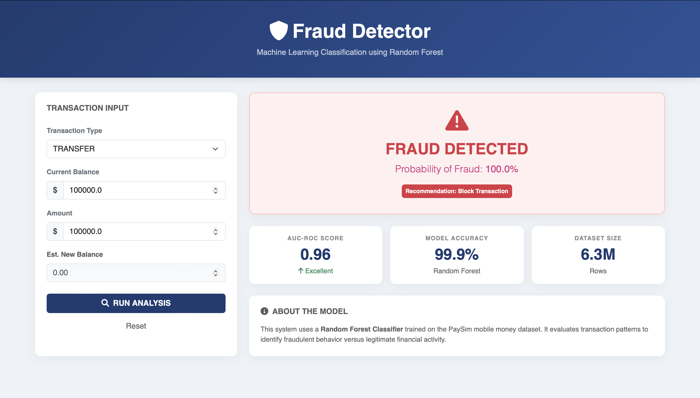
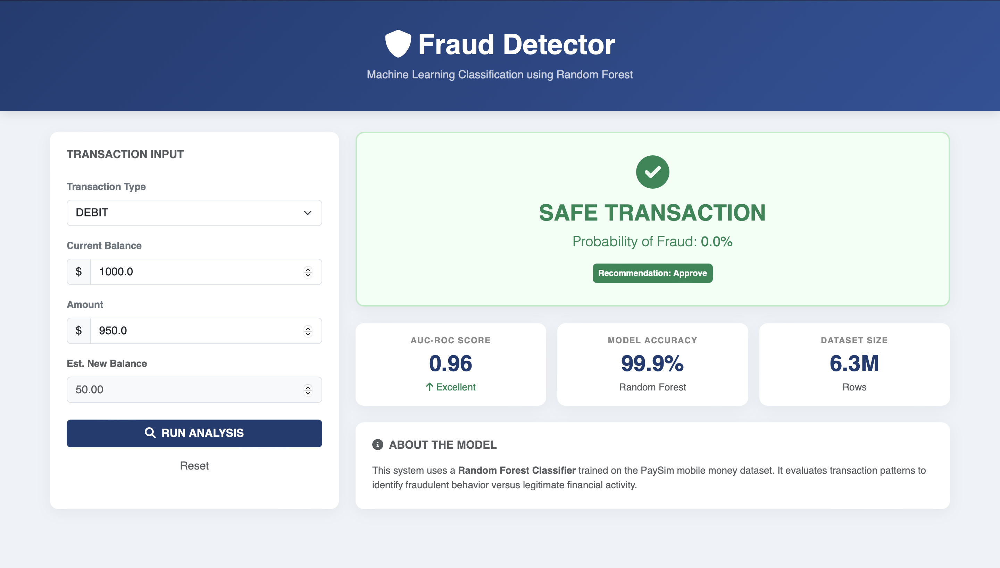

# Online Transaction Fraud Detection System


An end-to-end machine learning web application designed to identify and flag fraudulent financial transactions in real-time. This system integrates a **Random Forest Classifier** with a **Django** web framework to provide an interactive interface for transaction analysis.

---

## Machine Learning Engine

The core predictive logic is developed in the accompanying Jupyter Notebook: `notebook/online_transaction_fraud_detection.ipynb`.

### Model Performance
The model addresses the highly imbalanced nature of financial fraud data using a **Random Forest Classifier**.

* **Training Accuracy:** 0.99
* **Validation Accuracy:** 0.96
* **Algorithm:** Random Forest (Optimized for imbalanced classification)

### Model Evaluation (Confusion Matrix)
The confusion matrix below demonstrates the model's ability to distinguish between valid transactions and actual fraud cases, minimizing false negatives.


<br>

### Dataset
The model was trained on the **PaySim** dataset, a synthetic financial dataset designed to simulate mobile money transactions.
* **Source:** [Kaggle - PaySim](https://www.kaggle.com/datasets/ealaxi/paysim1)
* **Volume:** ~6.3 million transaction records.

---

## Web Interface (Dashboard)

A Django-based dashboard serves as the frontend for the model, allowing users to input transaction parameters and receive instant classification.

### Key Features
* **Real-Time Inference:** Direct integration with the pickled model for sub-second predictions.
* **Robust Backend Logic:** Powered by **Django** to handle secure data processing and session management efficiently.
* **Sticky Form Logic:** Retains input values post-submission to facilitate rapid testing of multiple scenarios.
* **Status Indicators:** Visual cues (Red/Green) for immediate risk assessment.

### Fraud Detection Scenarios
**Fraud Scenario 1:**
<br>


<br><br>

**Fraud Scenario 2:**
<br>


<br><br>

**Safe Scenario:**
<br>

---

## Installation & Execution

Follow these steps to deploy the application locally.

### 1. Clone the Repository
```bash
git clone https://github.com/DhanyaB21/Online_Transaction_Fraud_Detection.git
cd Online_Transaction_Fraud_Detection
```

### 2. Install Dependencies

```bash
pip install -r requirements.txt

```

### 3. Environment Configuration

Create a `.env` file in the root directory to secure sensitive configurations:

```ini
DEBUG=True
SECRET_KEY=your_secure_random_key_here

```

### 4. Run the Server

```bash
python manage.py migrate
python manage.py runserver

```

Access the dashboard at: `http://127.0.0.1:8000/dashboard/`

---

## Future Scope

* **REST API Conversion:** Refactor the backend to expose a JSON endpoint (using Django REST Framework) for mobile app integration.
* **Deep Learning Integration:** Implementation of LSTM (Long Short-Term Memory) networks to analyze sequential transaction patterns over time.
* **Explainable AI (XAI):** Integration of SHAP (SHapley Additive exPlanations) values to provide users with detailed reasoning behind each fraud classification.

---